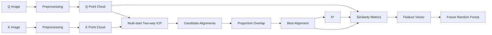

# ICP alignment and similarity features

## Pipeline

## Alignment

Preprocessing produces point rows `[x, y]`. ICP only estimates the rigid transform `T(x) = R(theta)x + t`; it never scales, deforms, or applies perspective changes. `scipy.spatial.cKDTree` supplies nearest-neighbour correspondence.

For each 4%, 5%, 6%, 20%, and 50% deterministic sample, the pipeline runs `none`, `left`, `right`, `up`, and `down` starts. Shift magnitudes are twice the moving cloud range. It evaluates both K→Q and Q→K; the latter is inverted so every candidate still transforms K into Q coordinates. The selected candidate has highest Q overlap at distance 3, with RMSE only as a tie-breaker. Its transform is applied to the complete K cloud to create K*.

## Similarity features

`FEATURE_NAMES` has exactly 35 entries: point counts (2), bidirectional overlap at five distances (10), rounded-coordinate Jaccard (3), Q-to-K* minimum-distance distribution (7), Ward/K-means clustering at k=20 and k=100 (8), phase-correlation peak/PSR (2), and aligned-image NCC/MSE/SSIM (3).

The clustering path uses Ward centroids to initialise Q K-means, then Q centroids to initialise K* K-means. If a cloud is smaller than the requested k, k is reduced and logged; the stable feature names remain unchanged. All random sampling and K-means seeds are configurable through `ICPConfig.random_seed`.

Phase correlation uses full original grayscale images thresholded at 85, embedded in a common unresized canvas. Its peak value is `max(correlation) / mean(correlation)`; PSR is `(peak - sidelobe_mean) / sidelobe_std`, excluding a 5×5 peak neighbourhood. NCC, MSE, and SSIM use K warped into Q's original image frame using the final rigid transform. Safe zero values are returned when a denominator or SSIM window is invalid.

## API and UI

`POST /api/v1/matching/align` and `/api/v1/matching/features` accept multipart `q_image`, `k_image`, and optional `threshold`, `max_iterations`, and `tolerance`. They return alignment diagnostics, the fixed feature vector, timing, and data-URL debug artifacts including an overlay (Q blue, K* red). Validation errors return the common `{ success: false, error: { code, message } }` response.

The **So khớp dấu giày** screen uploads Q/K images, displays originals plus the final overlay, alignment statistics, grouped metrics, and the complete vector. It intentionally contains no Random Forest prediction.

## Limitations

This synchronous research baseline can be expensive for large point clouds; ICP samples for fitting but similarity metrics still use full output clouds. Artifacts are inline data URLs. The selection uses Q overlap at distance 3 from the supplied overlap series. Future Phase 3 can consume the deterministic 35-key feature dictionary directly.
